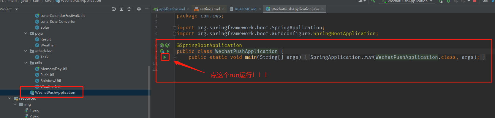

# (JAVA)微信公众号推送早安问候以及天气


## 教程: <br />

### **1.注册微信测试账号，编辑模板**

https://mp.weixin.qq.com/debug/cgi-bin/sandbox?t=sandbox/login <br/>
把appId、secret都配置到application.yml。
扫码关注得到用户的id,配置到application.yml的userId。

编辑模板:

```
今天是{{date.DATA}}
{{lunar.DATA}} {{festival.DATA}}
{{remark.DATA}}
{{city.DATA}}的天气: {{weather.DATA}}
最低气温: {{low.DATA}}度
最高气温: {{high.DATA}}度
风力: {{wc_day.DATA}}
风向: {{wd_day.DATA}}
今天是我们恋爱的第{{loveDays.DATA}}天
距离宝宝的生日还有{{birthdays.DATA}}天
{{rainbow.DATA}}
```


模板ID配置到application.yml的templateId

### **2.打开百度地图开放平台:**

**地址：https://lbsyun.baidu.com/apiconsole/center#/home** <br/>
**天气服务接口文档:** **https://lbs.baidu.com/index.php?title=webapi/weather**  <br/>
**创建应用:选择服务端，ip地址不知道怎么填就填   0.0.0.0/0 不要泄露自己的AK就行**  <br/>
**https://lbsyun.baidu.com/apiconsole/key#/home**

应用AK配置到application.yml的ak。<br/>
要查询的城市ID配置到application.yml的district_id。<br/>
备注:城市对应ID可在https://lbs.baidu.com/index.php?title=webapi/weather 的服务文档的请求参数的district_id一栏下载 “**行政区划编码**” 查看 <br/>

### **3.彩虹屁平台**

https://www.tianapi.com/
apiKey配置到application.yml的rainbowKey

备注:需要在天行数据注册账号并申请该接口

### **4.如何运行?**

只需修改application.yml里的配置即可运行,代码其他部分无需任何修改。


启动项目后打开浏览器输入  localhost/test  即可手动调用。
定时任务默认每天早8点推送,如需修改可去Task类上修改cron表达式。


###### `有问题欢迎留言或者私信`

## 常见问题


### **1.推送失败：{"errcode":40003,"errmsg":"invalid openid rid: 630576d8-1139d71c-6d68a976"}**

这个是由于userId填的不对,userId是微信公众号上扫码关注后生成的一串字符串,不是关注人的微信号。

 

改成下面红框里的重启程序即可

 

### **2.推送失败：{"errcode":40125,"errmsg":"invalid appsecret rid: 6305aafd-5a6dbc88-1da22e34"}**

​    这是由于微信的appsecret没填对

## 代码优化

### **1.关于大家遇到的空指针问题都做了优化处理**。

现在异常情况会反馈到界面上,你们可以根据报错信息查找原因,而不是面对NullPointerException


### 2.为了满足你们的需求,增加了推送给多个关注用户的功能,在userId配置多个即可。

**手动调用结果展示：**


**注意**：

模版消息本身是不支持群发的。这些通知的对象都是单个人，而非群体，所以微信接口并没有允许一次传递多个openid。
代码实现的发送给多个人，本质上是多次调接口（填写几个userId就会调用几次微信发送消息的接口,天气接口和天行数据接口不会重复调用,不会消耗调用次数）。
一天最多推送100000条。
具体可查看 [https://mp.weixin.qq.com/wiki?t=resource/res_main&id=mp1433751277](https://gitee.com/link?target=https%3A%2F%2Fmp.weixin.qq.com%2Fwiki%3Ft%3Dresource%2Fres_main%26id%3Dmp1433751277)

### 3.新增农历生日计算,可在配置界面选择你的生日计算方式。

如果当天是二十四节气或者重大节日（国庆中秋等）也会显示出来。

## 如果我的代码对你有帮助,欢迎给我一个Star

#### 本项目根据博客教程开发而来，码云上有人用我代码只改一下readme文件就上传到自己仓库也不标明原作者，希望大家都能支持原创吧！！！

#### respect!!!

# 关于运行

## 1.下载下来等依赖下载完，配置好参数，运行启动类即可。

最近有很多朋友问我怎么运行，这个项目就是一个springboot项目，直接运行启动类就运行起来了。

因为有很多不会springboot的兄弟，所以我再提一下。首先项目下载到本地，无论是通过git还是zip。

直接在idea打开就行了，通过maven下载项目所需依赖。

## 2.如果没有maven

### 1.先下载maven。

### 2.配置maven系统环境变量。

### 3.在maven的setting.xml里修改本地仓库路径和添加阿里云仓库镜像。

```xml
<localRepository>F:\pandownload\maven_repository</localRepository>
```

```xml
<mirror>  
    <id>aliyunmaven</id>   
    <mirrorOf>*</mirrorOf>  
    <name>阿里云公共仓库</name>    
    <url>https://maven.aliyun.com/repository/public</url>
</mirror>
```

### 4.在idea配置maven安装路径。


### 5.利用idea自动下载项目所需依赖。


第一次下载依赖会比较慢，因为你的仓库很多依赖都没有，大概需要几分钟到10分钟，下载完没有爆红就可以启动项目了

